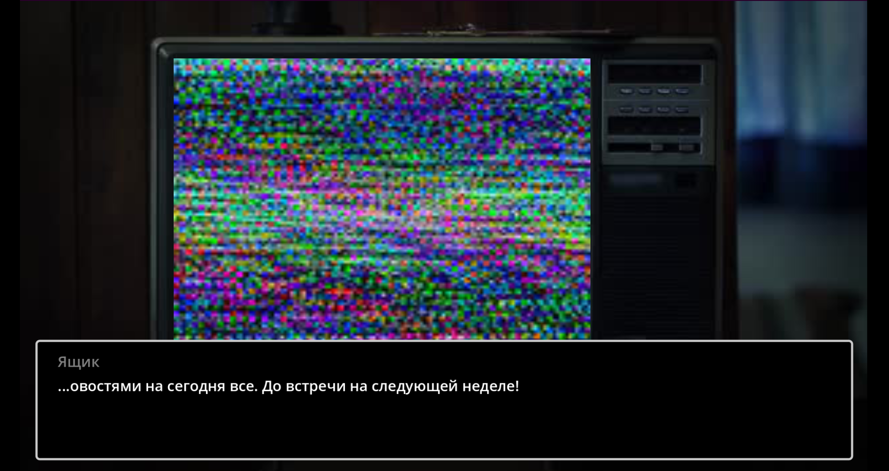

# No laugh left behind

[Игра](https://globalgamejam.org/games/2024/no-laugh-left-behind-1) создана в процессе участия в Global Game Jam 2024 на площадке ЮУрГУ.
## English
The action takes place in a world where laughter has been banned for many years. Almost all people have forgotten how to laugh, and most of them grew up never laughing.
They play a children's horror story on TV: three brothers catch a pike on the river, and she offers them to let it go in exchange for their wish being granted. The first brother wished, the second brother wished, and the third brother wished to laugh forever, which is why he died...

The main character is a black laughter merchant.

## Русский

Действия происходят в мире, где смех запрещен уже множество лет. Почти все люди разучились смеяться, а большая часть выросла никогда не смеявшись.
По телевизору крутят детскую страшилку: три брата поймали на реке щуку, она им предлагает отпустить её взамен на исполнение желания. Первый брат загадал , второй брат загадал , а третий брат загадал смеяться вечно, от чего и умер…

Главный герой – черный торговец смехом. 

# Installation Instructions
## English
  1) Install Windows 10
  2) Unpack the archive with the game
  3) Play
## Русский
  1) Установить Windows 10
  2) Распаковать архив с игрой
  3) Играть

# Оригинальный саундтрек

#### Заглавная тема

#### Интро

#### Ресторан

#### Flex intro

И многие другие... которые можно услышать в процессе игры
# Скриншоты игры

